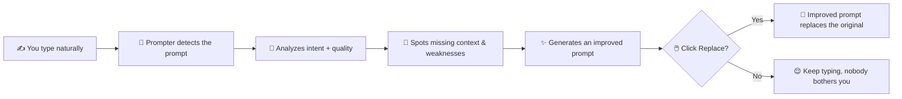
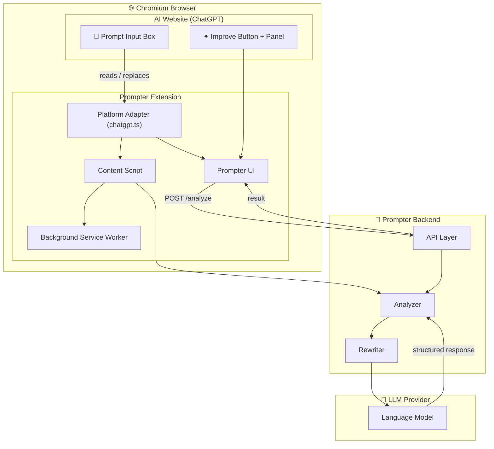

<div align="center">

# ✦ Prompter

### The AI Prompt Intelligence Layer

**Type naturally. Let Prompter make sure your AI actually understands you.**

Prompter is a browser extension that lives **inside your AI chat** — it analyzes what you
write, spots the missing context, and quietly hands you back a clearer prompt. One click.
Your intent, unchanged. Your AI, suddenly smarter.

<br/>

[](https://developer.chrome.com/docs/extensions/mv3/intro/)
[](https://www.typescriptlang.org/)
[](https://chatgpt.com/)
[](Project_Context.md)

</div>

---

## 💡 The Idea in One Flow

Chatting with an AI is a skill. Most prompts are vague, ambiguous, or missing the one
detail that would unlock a great answer. Prompter fixes that **in place**, without ever
breaking your flow:



No copy-paste dancing between ChatGPT and a "prompt enhancer" website. No modal popups
slamming into your screen. Just a small **✦ Improve** control sitting quietly beside your
input, ready when you want it.

---

## 🚨 The Problem

People give AI incomplete, ambiguous or poorly structured instructions all the time:

```text
make a website for my college fest
fix my python code
explain this
make this better
give me a good project idea
```

These communicate the *general idea*, but often lack **context, constraints, target
audience, technical requirements, expected output, examples** — the exact things that
separate a meh answer from an excellent one.

Prompter removes the manual workaround (write → copy → open enhancer → paste → improve →
copy → paste back) and replaces it with a single interaction:

> **Type → Analyze → Improve → Replace**

---

## ⚖️ The Core Principle

> **Prompter improves your communication. It never changes your intent.**

If you write *"Build me a portfolio website"*, Prompter will *not* silently decide you
actually want a React + Next.js cyberpunk SPA. It distinguishes four things:

| Thing                        | What Prompter does                                   |
|------------------------------|------------------------------------------------------|
| ✅ **Known intent**          | Keeps it exactly as you said                         |
| ⚠️ **Missing information**   | Detects it and suggests filling the gap              |
| 🤔 **Reasonable assumptions**| May infer — but clearly labels them as assumptions   |
| ✨ **Optional enhancement**  | Offers, never forces                                 |

That honesty is the entire brand. Prompter *teaches* you how to talk to AI — it doesn't
just rewrite words.

---

## ✨ Key Features

- 🔍 **Intent detection** — understands *what* you're trying to accomplish (coding,
  learning, writing, design, brainstorming…) before suggesting anything.
- 🧭 **Context analysis** — knows what a good prompt needs and spots what's missing.
- ⏱️ **Constraint awareness** — language, framework, budget, audience, output format…
- 🎯 **Specificity & ambiguity checks** — calls out "make it better" → *better how?*
- 📊 **Prompt Health** — an honest, UX-level quality indicator (not fake precision):

  ```text
  PROMPTER
  Prompt Health        72%
  Your goal is clear.

  Missing:
  ⚠ Target audience
  ⚠ Visual direction
  ⚠ Required sections

  Suggested prompt:
  Create a modern website for Tathva, a college technology
  festival. Design it for college students and prospective
  participants. Use a futuristic technology-focused visual
  direction and include sections for events, schedule,
  sponsors, registration and contact information.

  [ Replace ]  [ Copy ]  [ Explain ]
  ```

- 💬 **Explain ("Why?")** — tells you *why* each change was made, so you learn to write
  better prompts yourself.
- 😌 **Passive & Active modes** — quietly hints at improvements; never covers your UI.
- 🔌 **Platform adapters** — ChatGPT today; Claude, Gemini & more to come.

---

## 🏗️ Architecture

Clean separation is the whole game. Platform-specific hacks stay in *adapters*; the AI
intelligence stays *platform-independent*.



- **Platform Adapters** → how to detect, read, and replace the prompt on *each* site.
- **Prompter Core** → intelligence that stays platform-agnostic.
- **Backend API** → keeps LLM credentials server-side (never in the browser).

---

## 📁 Project Structure

```text
prompter/
│
├── extension/                  # Chromium extension (Manifest V3)
│   ├── manifest.json           # Extension identity
│   ├── content/                # Content-script pipeline
│   │   ├── content.ts          # Entry point
│   │   ├── detector.ts         # Intent / issue detection
│   │   └── injector.ts         # Injects Prompter UI presence
│   ├── ui/                     # Everything visible to the user
│   │   ├── prompter-button.ts
│   │   ├── analysis-panel.ts
│   │   └── styles.css
│   ├── adapters/               # Platform-specific code
│   │   └── chatgpt.ts          # ChatGPT adapter (current target)
│   ├── popup/                  # Toolbar popup
│   │   └── popup.html
│   ├── background/             # MV3 service worker
│   │   └── service-worker.ts
│   └── icons/
│
├── backend/                    # Prompt intelligence service
│   ├── api/                    # HTTP endpoints
│   ├── analyzer/               # Prompt analysis logic
│   └── rewriter/               # Prompt rewrite logic
│
└── shared/                     # Types & schemas shared across layers
    ├── types.ts
    └── schemas.ts
```

---

## 🛣️ Roadmap

| Phase | Goal                                              | Status            |
|-------|---------------------------------------------------|-------------------|
| 0     | Research (MV3, content scripts, adapters)         | ✅ Done           |
| 1     | Extension prototype (mock improve → replace)      | 🚧 In progress    |
| 2     | Real AI via backend + LLM (structured output)     | ⬜ Planned        |
| 3     | Prompt intelligence (health, modes, explanations) | ⬜ Planned        |
| 4     | Platform expansion (Claude, Gemini, Perplexity)   | ⬜ Future         |
| 5     | Dashboard (history, analytics, settings)          | ⬜ Future         |

---

## 🛠️ Development

> V1 is intentionally small: **prove the interaction first**.

### Requirements

- Chromium-based browser (Chrome / Edge / Brave)
- Node.js 18+ (for the TypeScript build, coming in Phase 1)
- ChatGPT account (target platform)

### Running the extension

```bash
# Phase 1 will introduce the build tooling:
npm install
npm run build

# Then load the extension:
#   chrome://extensions → enable Developer mode → Load unpacked → select /extension
```

### Acceptance criteria (V1)

- [x] Valid Manifest V3 (extension identity) — `manifest.json`
- [ ] Content script loads on ChatGPT
- [ ] Prompt input detected reliably
- [ ] "✦ Improve" control appears without breaking ChatGPT
- [ ] Current prompt can be read & sent to the analysis layer
- [ ] Improved prompt arrives back & is displayed
- [ ] **Replace** correctly updates ChatGPT's input
- [ ] User can dismiss Prompter; typing is never interrupted

---

## 🛡️ Privacy

Prompts can contain sensitive information, so Prompter treats them that way:

- No storing prompts unnecessarily
- No logging complete prompts by default
- Nothing sent anywhere without a clear product behaviour
- LLM credentials stay **server-side**, never in the browser

---

## 📜 License

Work in progress — no license declared yet.