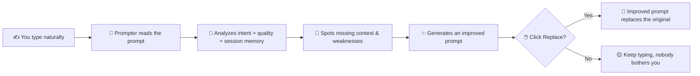

<div align="center">

# ✦ Prompter

### The AI Prompt Intelligence Layer

**Type naturally. Let Prompter make sure your AI actually understands you.**

Prompter is a browser extension that lives **inside your AI chat** — it analyzes what you
write, spots the missing context, and quietly hands you back a clearer prompt. One click.
Your intent, unchanged. Your AI, suddenly smarter.

<br/>

[](https://developer.chrome.com/docs/extensions/mv3/intro/)
[](https://www.typescriptlang.org/)
[](https://chatgpt.com/)
[](DEV_NOTES.md)

</div>

---

## 💡 The Idea in One Flow

Chatting with an AI is a skill. Most prompts are vague, ambiguous, or missing the one
detail that would unlock a great answer. Prompter fixes that **in place**, without ever
breaking your flow:



No copy-paste dancing between ChatGPT and a "prompt enhancer" website. Just a small
**✦ Improve** control sitting quietly in the bottom-right corner of your screen, ready
when you want it.

---

## 🚨 The Problem

People give AI incomplete, ambiguous or poorly structured instructions all the time:

```text
make a website for my college fest
fix my python code
explain this
make this better
give me a good project idea
```

These communicate the *general idea*, but often lack **context, constraints, target
audience, technical requirements, expected output, examples** — the exact things that
separate a meh answer from an excellent one.

Prompter removes the manual workaround (write → copy → open enhancer → paste → improve →
copy → paste back) and replaces it with a single interaction:

> **Type → Analyze → Improve → Replace**

---

## ⚖️ The Core Principle

> **Prompter improves your communication. It never changes your intent.**

If you write *"Build me a portfolio website"*, Prompter will *not* silently decide you
actually want a React + Next.js cyberpunk SPA. It distinguishes four things:

| Thing                        | What Prompter does                                   |
|------------------------------|------------------------------------------------------|
| ✅ **Known intent**          | Keeps it exactly as you said                         |
| ⚠️ **Missing information**   | Detects it and suggests filling the gap              |
| 🤔 **Reasonable assumptions**| May infer — but clearly labels them as assumptions   |
| ✨ **Optional enhancement**  | Offers, never forces                                 |

That honesty is the entire brand. Prompter *teaches* you how to talk to AI — it doesn't
just rewrite words.

---

## ✨ Key Features

- 🔍 **Intent detection** — understands *what* you're trying to accomplish (coding,
  learning, writing, design, brainstorming…) before suggesting anything.
- 🧭 **Context analysis** — knows what a good prompt needs and spots what's missing.
- 🧠 **Per-chat memory** — session context is scoped to each ChatGPT conversation.
  Reopening an old chat restores its memory; a new chat starts clean. Analysis is cached
  (with a key that includes the chat id, so results never leak between conversations).
- 🖼️ **Image awareness** — attached images are detected and referenced in the improved
  prompt; visual context from earlier turns carries forward.
- 👤 **Human professional roles** — every improved prompt opens with a real expert persona
  matched to your intent ("a professional graphic designer", "a senior software engineer",
  "an experienced chef"), never a generic "AI assistant".
- 🎚️ **Rewrite modes (Light / Balanced / Deep)** — pick how aggressively Prompter
  improves your prompt; the choice persists across sessions.
- ✏️ **Edit before replace** — tweak the suggested prompt inline before committing it, and
  Reset to the original suggestion if you change your mind.
- 📊 **Prompt Health** — an honest, UX-level quality indicator (not fake precision):

  ```text
  Prompt Health        72%
  Good start — a few details would help.

  Issues Found
  ! Does not specify the target audience
  • No output format requested

  Suggested prompt:
  [Tagged sections you can edit inline]
  [ Replace ]  [ Copy ]  [ Why? ]
  ```

- 💬 **Explain ("Why?")** — tells you *why* each change was made, so you learn to write
  better prompts yourself.
- ⌨️ **Keyboard-friendly** — `Ctrl/Cmd+Shift+Y` to improve instantly, `Escape` to close
  (or exit edit mode first), `Tab` focus trap inside the panel, `?` for a shortcut cheat
  sheet.
- 🌗 **Dark mode** — a monochrome theme that follows your system preference, plus a
  `prefers-reduced-motion` friendly UI.
- 🔌 **Platform adapters** — ChatGPT today; Claude, Gemini & more to come.

---

## 🏗️ Architecture

Clean separation is the whole game. Platform-specific hacks stay in *adapters*; the AI
intelligence stays *platform-independent*.

```mermaid
flowchart TB
    subgraph Browser["🌐 Chromium Browser"]
        subgraph Page["AI Website (ChatGPT)"]
            INPUT["📝 Prompt Input Box"]
            UI2["✦ Improve Button + Panel"]
        end
        subgraph EXT["Prompter Extension"]
            CS["Content Script"]
            ADAPTER["Platform Adapter (chatgpt.ts)"]
            UILAYER["Prompter UI"]
            SW["Background Service Worker"]
        end
    end

    subgraph BE["🚀 Prompter Backend"]
        API["/analyze + /health"]
    end

    subgraph LLM["🤖 LLM Provider"]
        MODEL1["Primary: gpt-oss-120b"]
        MODEL2["Fallback: gpt-oss-20b"]
    end

    INPUT -->|reads / replaces| ADAPTER
    ADAPTER --> CS
    CS -->|context, images (metadata)| API
    ADAPTER --> UILAYER
    UI2 --> UILAYER
    UILAYER -->|message /analyze| API
    API --> MODEL1
    MODEL1 -->|refuses / errors| MODEL2
    MODEL2 -->|structured response| API
    API -->|result| UILAYER
    CS --> SW
```

- **Platform Adapters** → how to detect, read, and replace the prompt on *each* site.
- **Prompter Core** → intent/context intelligence + the per-chat memory store.
- **Backend API** → keeps LLM credentials server-side (never in the browser), with rate
  limiting, input validation, CORS allow-listing and a multi-model fallback.

---

## 📁 Project Structure

```text
prompter/
│
├── extension/                  # Chromium extension (Manifest V3)
│   ├── manifest.json           # Version, permissions, commands, content_scripts
│   ├── types.ts                # Shared types (AnalysisResult, AnalysisContext, …)
│   ├── content/                # Content-script pipeline
│   │   ├── content.ts          # Entry point: analyse flow, cache, FAB wiring
│   │   ├── context-store.ts    # Per-chat memory (chrome.storage.local)
│   │   ├── detector.ts         # Local mock analyzer (backend fallback)
│   │   └── injector.ts         # FAB + onboarding tip
│   ├── ui/                     # Everything visible to the user
│   │   ├── analysis-panel.ts   # Panel, loading/error, edit mode, toast, help
│   │   └── styles.css          # Monochrome theme (light + dark)
│   ├── adapters/               # Platform-specific code
│   │   └── chatgpt.ts          # ChatGPT adapter (read/write prompt, images)
│   ├── background/             # MV3 service worker
│   │   └── service-worker.ts   # /analyze proxy + shortcuts relay
│   ├── popup/                  # Toolbar popup
│   │   └── popup.html
│   └── icons/
│
└── backend/                    # Prompt intelligence service (Node + Express)
    ├── server.mjs              # POST /analyze, GET /health (hardened)
    ├── .env.example            # Config template (copy to .env)
    ├── analyzer/               # Reserved for analyzer logic
    ├── rewriter/               # Reserved for rewriter logic
    └── api/                    # Reserved for API layer
```

---

## 🛣️ Roadmap

| Phase | Goal                                              | Status            |
|-------|---------------------------------------------------|-------------------|
| 0     | Research (MV3, content scripts, adapters)         | ✅ Done           |
| 1     | Extension prototype (mock improve → replace)      | ✅ Done           |
| 2     | Real AI via backend + LLM (structured output)     | ✅ Done           |
| 3     | Prompt intelligence (health, modes, explanations) | ✅ Done           |
| 4     | Platform expansion (Claude, Gemini, Perplexity)   | ⬜ Future         |
| 5     | Dashboard (history, analytics, settings)          | ⬜ Future         |

---

## 🛠️ Development

### Requirements

- Chromium-based browser (Chrome / Edge / Brave)
- Node.js 18+ (TypeScript build + backend)
- ChatGPT account (target platform)
- Groq API key for real analysis (`backend/.env`)

### Running the backend

```bash
# 1. Get a free Groq API key: https://console.groq.com/keys
# 2. Create the secret env file (gitignored):
Copy-Item backend/.env.example backend/.env   # Windows
cp backend/.env.example backend/.env          # Mac/Linux

# 3. Edit backend/.env → paste your GROQ_API_KEY

# 4. Start the server (default http://localhost:3001):
npm run server
```

The backend uses `backend/.env` — see [`backend/.env.example`](backend/.env.example). If the
server isn't running, the extension quietly falls back to the built-in local mock analyzer —
stay functional, Rule 11.

#### Optional backend configuration (all env-tunable)

| Variable                 | Default               | What it does                                  |
|--------------------------|-----------------------|-----------------------------------------------|
| `PORT`                   | `3001`                | HTTP listen port                              |
| `GROQ_MODEL`             | `openai/gpt-oss-120b` | Primary analysis model                        |
| `GROQ_MODEL_FALLBACK`    | `openai/gpt-oss-20b`  | Used if the primary model fails               |
| `GROQ_TIMEOUT_MS`        | `30000`               | Per-attempt request timeout                   |
| `RATE_LIMIT_MAX`         | `20`                  | Max `/analyze` requests per window per IP     |
| `RATE_LIMIT_WINDOW_MS`   | `60000`               | Rate-limit window                             |
| `PROMPT_MAX_CHARS`       | `8000`                | Max accepted prompt length                    |
| `CORS_ALLOWED`           | `https://chatgpt.com` | Comma-separated allowed origins (+ `chrome-extension://` always allowed) |

### Running the extension

```bash
npm install
npm run build

# Then load the extension:
#   chrome://extensions → enable Developer mode → Load unpacked → select /extension
```

Rebuild with `npm run build` (or `npm run watch`) after any source change and reload the
extension from `chrome://extensions`. The backend listens on port `3001` by default; change
`PORT` in `backend/.env` to run it elsewhere.

### Manifest highlights

- MV3 service worker handles analyses and relays the `improve-prompt` command.
- Content script runs on `https://chatgpt.com/*` only.
- Permissions are minimal: `storage`, `activeTab`, `scripting`.
- Shortcut: `Ctrl`/`Cmd`+`Shift`+`Y`.

---

## 🛡️ Privacy

Prompts can contain sensitive information, so Prompter treats them that way:

- No storing prompts unnecessarily (session memory is metadata + text, capped and scoped
  per chat in `chrome.storage.local`)
- No logging complete prompts by default (backend logs request id, status, latency only)
- Nothing sent anywhere without a clear product behaviour
- LLM credentials stay **server-side**, never in the browser
- Image data is never uploaded — only filenames/metadata reach the backend

---

## 📜 License

Work in progress — no license declared yet.